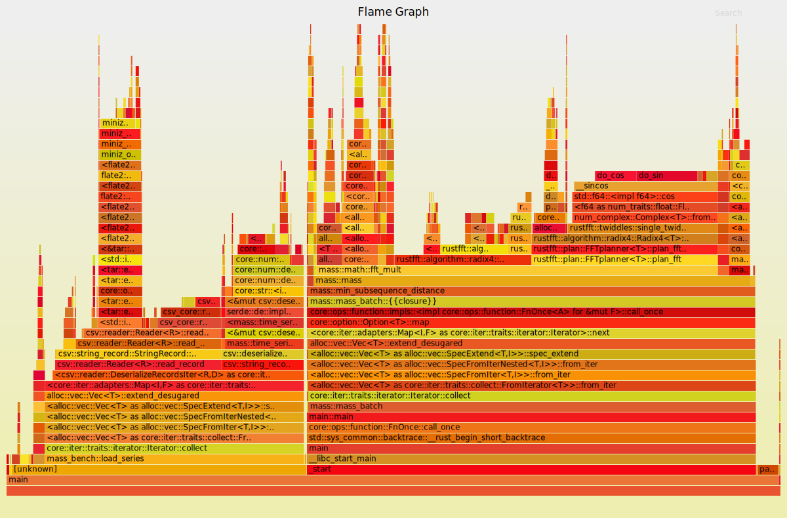
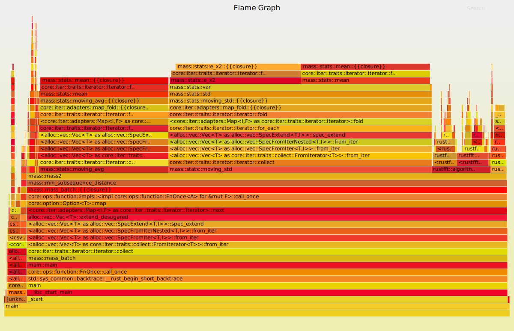

# Welcome to the benchmarks workspace for MASS in rust.
The aim of this repo is to keep track of the optimization efforts in [mass](https://github.com/CAGS295/mass).

---
## *V0.1.0-alpha-851ebbd9*
---
JIT mean and standard deviation; complexity goes from  O(nm) down to O(n) for m << n.
Time complexity dominated by fft with O(nlogn).


Short Bench time:   [12.870 ms 12.905 ms 12.946 ms]

    change: [-35.648% -34.853% -34.165%] (p = 0.00 < 0.05)
    Performance has improved.

Found 9 outliers among 100 measurements (9.00%)

  5 (5.00%) high mild

  4 (4.00%) high severe


## *V0.1.0-alpha-3c4cf5aa*
---
MASS V3 algorithm.
Bug fixes in batch size partition.

 Short Bench time:   [19.244 ms 19.295 ms 19.353 ms]

    change: [-25.106% -24.806% -24.521%] (p = 0.00 < 0.05)
    Performance has improved.

Found 2 outliers among 100 measurements (2.00%)

  2 (2.00%) high severe



---

## *V0.1.0-alpha-2d91e4dc*
---
Initial release.
 
Short Bench time:   [25.724 ms 25.957 ms 26.209 ms]

 Found 2 outliers among 100 measurements (2.00%)

  2 (2.00%) high mild


---

## Dont forget to allow profiling events

```bash
 $ echo -1 | sudo tee /proc/sys/kernel/perf_event_paranoid
 $ echo 0 | sudo tee /proc/sys/kernel/kptr_restrict
 ```

## Hardware specs:

> Architecture:                    x86_64
>
> CPU op-mode(s):                  32-bit, 64-bit
> 
> Byte Order:                      Little Endian
> 
> Address sizes:                   39 bits physical, 48 bits virtual
> 
> CPU(s):                          8
> 
> On-line CPU(s) list:             0-7
> 
>
> Thread(s) per core:              2
>
> Core(s) per socket:              4
>
> Socket(s):                       1
>
> NUMA node(s):                    1
>
> Vendor ID:                       GenuineIntel
>
> CPU family:                      6
>
> Model:                           142
>
> Model name:                      Intel(R) Core(TM) i5-8265U CPU @ 1.60GHz
>
> Stepping:                        11
>
> CPU MHz:                         3779.794
>
> CPU max MHz:                     3900.0000
>
> CPU min MHz:                     400.0000
>
> BogoMIPS:                        3600.00
>
> Virtualisation:                  VT-x
>
> L1d cache:                       128 KiB
>
> L1i cache:                       128 KiB
>
> L2 cache:                        1 MiB
>
> L3 cache:                        6 MiB
>
> NUMA node0 CPU(s):               0-7
>
> Vulnerability Itlb multihit:     KVM: Mitigation: Split huge pages
>
> Vulnerability L1tf:              Not affected
>
> Vulnerability Mds:               Mitigation; Clear CPU buffers; SMT vulnerable
>
> Vulnerability Meltdown:          Not affected
>
> Vulnerability Spec store bypass: Mitigation; Speculative Store Bypass disabled via prctl and seccomp
>
> Vulnerability Spectre v1:        Mitigation; usercopy/swapgs barriers and __user pointer sanitization
>
> Vulnerability Spectre v2:        Mitigation; Full generic retpoline, IBPB conditional, IBRS_FW, STIBP conditional, RSB fil
                                 >
                                 > ling
>
> Vulnerability Srbds:             Mitigation; Microcode
>
> Vulnerability Tsx async abort:   Not affected
>
> Flags:                           fpu vme de pse tsc msr pae mce cx8 apic sep mtrr pge mca cmov pat pse36 clflush dts acpi 
mmx fxsr sse sse2 ss ht tm pbe syscall nx pdpe1gb rdtscp lm constant_tsc art arch_perfmon
pebs bts rep_good nopl xtopology nonstop_tsc cpuid aperfmperf pni pclmulqdq dtes64 monitor ds_cpl vmx est tm2 ssse3 sdbg fma cx16 xtpr pdcm pcid sse4_1 sse4_2 x2apic movbe popcnt tsc_deadline_timer aes xsave avx f16c rdrand lahf_lm abm 3dnowprefetch cpuid_fault epb 
invpcid_single ssbd ibrs ibpb stibp tpr_shadow vnmi flexpriority ept vpid ept_ad fsgsbase
tsc_adjust bmi1 avx2 smep bmi2 erms invpcid mpx rdseed adx smap clflushopt intel_pt xsav
eopt xsavec xgetbv1 xsaves dtherm ida arat pln pts hwp hwp_notify hwp_act_window hwp_epp 
md_clear flush_l1d arch_capabilities